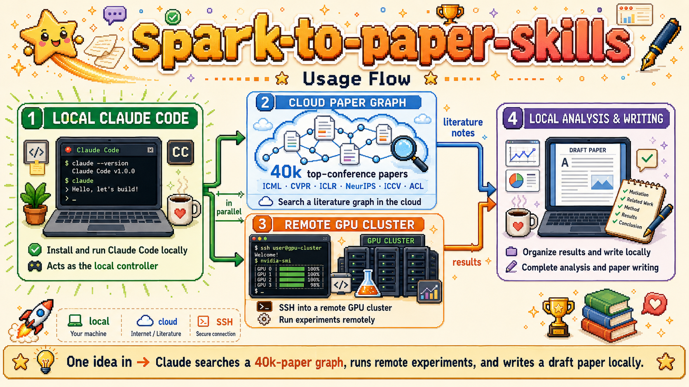
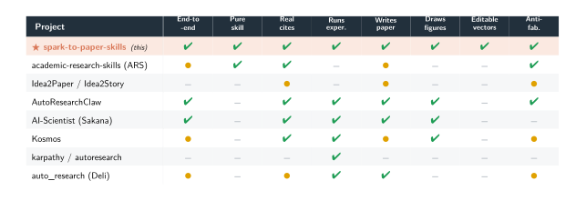
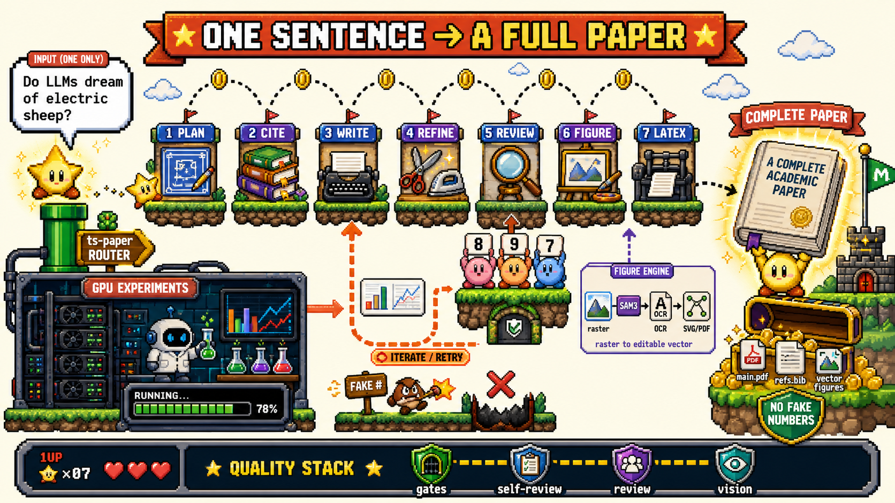

<p align="center">
  
</p>

<h1 align="center">spark-to-paper-skills</h1>

<h3 align="center"><b><i>Drop a spark. Get a paper.</i></b></h3>

<p align="center">
  <i>Every citation verified. Every figure editable. Every number traced to source.</i>
</p>

<p align="center">
  13 composable <a href="https://docs.anthropic.com/en/docs/agents-and-tools/claude-code">Claude Code</a> skills turn a one-line idea into a compiled PDF —<br>
  real references, editable vector figures, and machine-checked integrity included.<br>
  No app. No server. No setup.
</p>

<p align="center">
  <a href="https://github.com/Albus-White/spark-to-paper-skills/releases/latest"></a>
  <a href="https://github.com/Albus-White/spark-to-paper-skills"></a>
  
  
  
  
  <a href="LICENSE"></a>
</p>

<p align="center">
  <a href="#-generated-paper-showcase">🏆 Showcase</a> &middot;
  <a href="#-what-makes-it-different">✨ Features</a> &middot;
  <a href="#-how-it-compares">🧭 Compare</a> &middot;
  <a href="#-the-figure-engine">🖼️ Figure Engine</a> &middot;
  <a href="#-the-pipeline">🔬 Pipeline</a> &middot;
  <a href="#-quick-start">🚀 Quick Start</a>
</p>

---

## 🏆 Generated Paper Showcase

<table>
<tr>
<td width="18%">
<a href="docs/showcase/SHOWCASE.md"></a>
</td>
<td valign="middle">
<b>4 papers across 4 domains</b> — environmental monitoring, energy forecasting, environmental AI, computer vision — generated fully end-to-end with real citations, editable vector figures, and compiled PDF output.<br><br>
<a href="docs/showcase/SHOWCASE.md"></a>
</td>
</tr>
</table>

---

## ⚡ One Command. One Paper.

```bash
# Install — auto-loads on next Claude Code session
git clone https://github.com/Albus-White/spark-to-paper-skills.git ~/.claude/skills/spark-to-paper-skills
```

```
Run ts-paper on this proposal.   ← paste your idea, proposal, or data
```

The orchestrator auto-routes your input, picks the right mode, and runs the full chain.

---

## 📦 What You Get

<table>
<tr><td>📄</td><td><code>main.tex</code> · <code>main.pdf</code></td><td>Compiled paper in the selected venue template</td></tr>
<tr><td>📝</td><td><code>sections/*.tex</code></td><td>One LaTeX source file per section + abstract</td></tr>
<tr><td>🗺️</td><td><code>blueprint.json</code></td><td>Structured title, keywords, contributions, notation, word targets</td></tr>
<tr><td>📚</td><td><code>refs.bib</code></td><td>Real BibTeX entries — every <code>\cite{}</code> verified via WebSearch + Crossref</td></tr>
<tr><td>🖼️</td><td><code>figures/*.pdf</code></td><td>Editable vector figures (SVG + PDF + PPTX), originals always kept</td></tr>
<tr><td>🧪</td><td><code>experiments/</code></td><td>Auto-run experiment code + filled result tables (Stage 8)</td></tr>
<tr><td>📋</td><td><code>logs/*.io.md</code></td><td>Full INPUT / DECISIONS / OUTPUT trace for every stage</td></tr>
<tr><td>🚦</td><td><code>run_gates.py</code></td><td>All deterministic gates pass — citations, draft, vectors, LaTeX</td></tr>
</table>

---

## ✨ What Makes It Different

| | Capability | Description |
|:---:|---|---|
| 🖼️ | **Editable Vector Figures** | The feature no other tool has. AI-generated rasters are decomposed and reconstructed as editable SVG/PDF/PPTX via DrawAI hybrid (~0.91 SSIM). Not embedded bitmaps — real editable text overlays on pixel-exact renders. |
| 🔗 | **End-to-End** | Idea → literature → writing → experiments → figures → compiled PDF. The only pure Claude Code plugin that runs the entire arc. |
| 🔒 | **Machine-Checked Integrity** | No fabricated numbers — ever. Every citation verified. Deterministic gates fail the build on violations. Not a style suggestion — a hard stop. |
| 🔀 | **Two Integrity Modes** | *Proposal mode*: forward-looking, result cells stay blank. *Data-aware mode*: every number traced to your real data, in past tense. Machine-audited. |
| ⚔️ | **Adversarial Review** | N isolated reviewers read the whole paper with verbatim-quote anti-skim, then perspective-diverse skeptics try to refute each issue. Loop until dry. |
| 🧪 | **Auto-Experiments** | Stage 8 diagnoses logic, runs only feasible experiments on real data/code, fills result tables, and recompiles. Never invents results. |
| 📐 | **Template-Agnostic** | NeurIPS and IIETA bundled. Add any venue — drop a `templates/<name>/` dir with `template.json` + LaTeX assets. No code changes. |

---

## 🧭 How It Compares

<p align="center">
  
</p>

<p align="center"><sub><b>✓</b> full&nbsp;&nbsp;·&nbsp;&nbsp;<b>●</b> partial&nbsp;&nbsp;·&nbsp;&nbsp;<b>–</b> none&nbsp;&nbsp;|&nbsp;&nbsp;sources: <a href="https://github.com/Imbad0202/academic-research-skills">ARS</a> · <a href="https://github.com/AgentAlphaAGI/Idea2Paper">Idea2Paper</a> · <a href="https://github.com/aiming-lab/AutoResearchClaw">AutoResearchClaw</a> · <a href="https://github.com/SakanaAI/AI-Scientist">AI-Scientist</a> · <a href="https://github.com/jimmc414/Kosmos">Kosmos</a> · <a href="https://github.com/karpathy/autoresearch">karpathy/autoresearch</a> · <a href="https://victorchen96.github.io/auto_research/framework.html">auto_research</a></sub></p>

> The heavy autonomous scientists ([AutoResearchClaw](https://github.com/aiming-lab/AutoResearchClaw), [AI-Scientist](https://github.com/SakanaAI/AI-Scientist)) match the *breadth* — but ship as **standalone Python products** (Docker, Neo4j, tens of thousands of LOC). The lighter *skills* ([ARS](https://github.com/Imbad0202/academic-research-skills), [Idea2Paper](https://github.com/AgentAlphaAGI/Idea2Paper)) don't run experiments or draw figures. **Nobody else gives you all of it as drop-in Claude Code skills with editable vector figures.**

---

## 🖼️ The Figure Engine

**The capability no other skill suite has.** AI image models produce rasters — but a paper needs editable vector figures.

`ts-figure-optimize` vendors the full **DrawAI engine** and does not just embed a bitmap. It *decomposes and reconstructs* the figure:

```
raster figure (PNG/JPG)
   ├─ SAM3            → segment the layout into regions    (local, no account)
   ├─ PaddleOCR       → read every text run                (local, no account)
   ├─ Box-IR          → build a structured layout IR
   └─ HYBRID build    → pixel-exact render + editable <text> overlay
   │
   └─▶ editable SVG · vector PDF · editable PPTX   (~0.91 SSIM, ~63 editable text boxes)
```

| What | How | Result |
|---|---|---|
| **Graphics** | Kept pixel-exact — the render IS the approved image | 100% fidelity |
| **Text labels** | Re-typed as editable `<text>` overlays | Fully editable |
| **Cost** | Key-free, no account, runs on CPU or GPU | Zero API cost |
| **Fallback** | If DrawAI unavailable → keep the approved PNG as-is | Never a lossy redraw |

<details>
<summary>Provision the runtime (~4 GB, one-time)</summary>

```bash
python skills/ts-figure-optimize/scripts/setup_drawai.py --device cpu   # provision
python skills/ts-figure-optimize/scripts/setup_drawai.py --check-only   # doctor
```
</details>

---

<p align="center"><b><i>One spark in. One paper out.</i></b></p>

<p align="center">
  
</p>

---

## 🔬 The Pipeline

One orchestrator (`ts-paper`) routes the input, then drives a **7-stage chain** plus auto-run experiments:

```
                         ┌──────────────── optional upstream ────────────────┐
 [corpus.jsonl] ─▶ ts-kg-build ─▶ kg/         (research-pattern KG)
 [raw idea]     ─▶ ts-idea2story ─▶ story + citation seed
                         └──────────────────────────────────────────────────┘
                                                │
 [proposal  OR  proposal + real results]  ─────▶ ts-paper  (Stage 0: ROUTE)
                                                │
   1. ts-paper-plan ──▶ blueprint.json          title · keywords · contributions
   2. ts-paper-cite ──▶ refs.bib                ≥40 REAL refs via WebSearch + Crossref
   3. ts-paper-write ─▶ sections/*.tex          all sections in one holistic pass
   4. ts-paper-refine ▶ right-size + de-AI      scrub + logic self-check
   5. ts-paper-review ▶ adversarial review      multi-reviewer hardening
   6. ts-paper-figure ▶ figures + vectorize     image-model → DrawAI hybrid → editable PDF
   7. ts-paper-latex ─▶ main.pdf                assemble + compile
                                                │
   8. ts-paper-experiment (AUTO) ─▶ run feasible experiments, fill tables, recompile
```

<details>
<summary><b>Stage 0 — Input routing</b></summary>
<br>

| Class | What was dropped | Route | `results_mode` |
|---|---|---|---|
| **(a) bare idea** | one line, no method/eval structure | `ts-idea2story` → plan | `proposal` |
| **(b) proposal** | problem + method + eval, no measured results | plan (proposal) | `proposal` |
| **(c) proposal + REAL results** | measured numbers or attached data file | plan → `ts-paper-data` | `data_aware` |
| **(d) existing `story.json`** | 8-field story from a prior run | plan (skip idea2story) | `proposal` |

</details>

### Two modes, opposite integrity rules

| | **Proposal mode** | **Data-aware mode** |
|---|---|---|
| Numbers | Never invent — cells stay blank (`--`) | Report real numbers, past tense |
| Guarantee | No metric ever fabricated | Every number traces to your data (machine-audited) |

---

## 🎯 Design Philosophy

|     | Principle | Rule |
| :-: | :--- | :--- |
| 🧠 | **Model reasons** | Claude owns judgment-heavy work: writing, research, critique, review |
| 🛠 | **Code backstops** | Python handles deterministic tasks: linting, assembly, plotting, vectorization |
| 🪶 | **Zero infra** | No app, server, database, or Docker — copy skills into `.claude/skills/` and go |
| 🏆 | **Quality first** | Verify citations, self-review, run linters, polish before delivery |
| 🔒 | **Integrity always** | Never invent numbers; trace every value to source data; red gates fail the build |

---

## 🛡️ Quality Stack

Four complementary layers — Claude handles judgment, code provides the deterministic backstop.

| # | Layer | What it checks |
|---:|---|---|
| **1** | **Deterministic gates** | Section shape · word bands · no-fabrication · citation completeness · vector-PDF presence |
| **2** | **Self-review** | Right-sizing · term consistency · coherence · de-AI scrub |
| **3** | **Adversarial review** | N isolated reviewers · verbatim-quote anti-skim · loop until dry |
| **4** | **Vision critique** | Reads each rendered figure · checks faithfulness · readability · aesthetics |

```bash
python skills/ts-paper/scripts/run_gates.py <workdir> all     # nonzero exit = NOT done
```

---

## 📐 Template-Agnostic

Write to **whatever venue you pick** — content quality is invariant.

| Template | Venue | Style |
|---|---|---|
| `ts_iieta` *(default)* | Traitement du Signal | Two-column, numeric citations |
| `neurips` | NeurIPS (community) | Single-column, author-year |
| `neurips_official` | NeurIPS 2025 (official .sty) | Single-column, official formatting |

**Add a venue** by dropping a `templates/<name>/` dir with `template.json` + LaTeX assets — no code changes.

---

## 🧩 The Skills

13 skill folders; all active.

| Skill | Stage | Role |
|---|---|---|
| **`ts-paper`** | orchestrator | Routes input (idea / proposal / data) and drives the chain |
| `ts-idea2story` | upstream | Raw idea → structured research story + citation seed |
| `ts-kg-build` | upstream (opt.) | Corpus → research-pattern knowledge graph for recall |
| `ts-paper-plan` | 1 | Proposal → `blueprint.json` (one reasoning pass) |
| `ts-paper-cite` | 2 | Real, complete bibliography (WebSearch + Crossref, floor 40) |
| `ts-paper-write` | 3 | Draft all sections as LaTeX in one holistic pass |
| `ts-paper-refine` | 4 | Right-size + de-AI scrub + logic self-check |
| `ts-paper-review` | 5 | Adversarial peer-review hardening |
| `ts-paper-figure` | 6 | Figure routing: matplotlib (data) / image model (schematics) |
| `ts-paper-data` | 6 (data) | Data-aware mode: real results → filled tables + plots |
| `ts-figure-optimize` | 6 (vector) | Raster → editable SVG/PDF/PPTX via DrawAI hybrid |
| `ts-paper-latex` | 7 | Assemble + compile the final PDF |
| `ts-paper-experiment` | 8 | Run feasible experiments, fill tables, recompile |

---

## 🚀 Quick Start

### 1 · Install

**Option A — Claude Code plugin (recommended)**

```bash
git clone https://github.com/Albus-White/spark-to-paper-skills.git ~/.claude/skills/spark-to-paper-skills
```

Auto-loads on next session. Skills available as `/spark-to-paper:ts-paper`, etc.

**Option B — Try before you install**

```bash
git clone https://github.com/Albus-White/spark-to-paper-skills.git
claude --plugin-dir ./spark-to-paper-skills
```

**Option C — Standalone skills (no namespacing)**

```bash
cp -r spark-to-paper-skills/skills/ts-* ~/.claude/skills/
```

**Option D — Git submodule (auto-updatable)**

```bash
git submodule add https://github.com/Albus-White/spark-to-paper-skills.git .claude/skills/spark-to-paper-skills
```

> 💡 The suite checks GitHub for newer versions on each run. Update: `git -C ~/.claude/skills/spark-to-paper-skills pull`

### 2 · (Optional) Configure secrets

| Secret | Variables | When needed |
|---|---|---|
| 🎨 **Figure model** | `TS_FIG_API_KEY`, `TS_FIG_BASE_URL`, `TS_FIG_MODEL` | Render schematics with an image model |
| 👁️ **Vision QA** | `OPENAI_API_KEY`, `VISION_MODEL` | Correct figure text, per-region defect comparison |
| 🧠 **Embeddings** | `TS_EMBED_*` | KG-grounded recall (optional, graceful degradation) |
| 📦 **DrawAI** | `HF_TOKEN` | Download gated SAM3 weights once |
| ☁️ **Overleaf** | `OVERLEAF_GIT_URL`, `OVERLEAF_TOKEN` | Sync with Overleaf when enabled |

Copy `.env.example` → `.env` and fill in only what you use.

### 3 · Just ask Claude

```
Run ts-paper on this proposal.
```

Paste your idea, proposal, or proposal + data. The orchestrator auto-routes, runs the chain, and delivers a compiled paper with page count, sections, references, review outcome, and editable vector figures.

---

## 🔥 What's New

- **`v1.1.0`** — **Claude Code plugin support.** Restructured as a proper plugin with `.claude-plugin/plugin.json`. One-command install, auto-loads on session start.
- **`v1.0.1`** — **Soft update notification.** `check_update.py` queries GitHub Releases API on each run (24h cache, silent when up-to-date, never blocks).
- **`v1.0`** — **Initial release.** 13 skills, end-to-end pipeline, DrawAI hybrid figure engine, MIT License.

---

## ⚙️ Requirements

- **Claude Code** (the suite is a plugin)
- **Python 3.10+** with `pip install -r skills/ts-figure-optimize/requirements.txt`
- **LaTeX** (`latexmk` + a TeX distribution) for compilation
- *Optional:* DrawAI runtime (~4 GB) · image-model endpoint · LibreOffice

---

## 🙋 FAQ

<details>
<summary><b>Will it invent results to make the paper look complete?</b></summary>
<br>
No. In proposal mode, <code>draft_lint</code> fails the build on any prose number not backed by data. In data-aware mode, every number is audited against <code>results.facts.json</code>.
</details>

<details>
<summary><b>How is this different from AutoResearchClaw / AI-Scientist / Kosmos?</b></summary>
<br>
The heavy autonomous scientists match the breadth but ship as standalone Python products (Docker, Neo4j, tens of thousands of LOC). The other skills don't run experiments or draw figures. This is the only <b>pure Claude Code plugin</b> that does the whole arc — and the only tool of any kind with an <b>editable-vector figure engine</b>.
</details>

<details>
<summary><b>Do I need GPUs or the heavy DrawAI runtime?</b></summary>
<br>
Only for free-form raster figures. DrawAI runs on CPU; matplotlib figures are born-vector and skip the engine; a paper with no figures skips Stage 6 entirely.
</details>

<details>
<summary><b>Can I use a venue that isn't bundled?</b></summary>
<br>
Yes — drop a <code>templates/&lt;name&gt;/</code> directory with <code>template.json</code> + LaTeX assets. No code changes.
</details>

---

## ✅ Definition of Done

`main.pdf` exists and is non-trivial · **zero LaTeX errors** · `main.bbl` resolved all citations · every `\cite{}` maps to a complete `refs.bib` entry · **no fabricated numbers** anywhere · **every figure embedded as an editable vector PDF** · the adversarial **review stage ran** · and `run_gates.py <workdir> all` **exits zero**.

---

## 🙏 Acknowledgments

Inspired by:

- 🔬 [AI-Scientist](https://github.com/SakanaAI/AI-Scientist) (Sakana AI) — Automated research pioneer
- 🦞 [AutoResearchClaw](https://github.com/aiming-lab/AutoResearchClaw) (AIMING Lab) — 23-stage autonomous research pipeline
- 🧠 [autoresearch](https://github.com/karpathy/autoresearch) (Andrej Karpathy) — End-to-end research automation
- 🎨 [DrawAI](https://github.com/DrawAI) — Figure vectorization engine (vendored)

---

## ⭐ Star History

<p align="center">
  <a href="https://star-history.com/#Albus-White/spark-to-paper-skills&Date">
    
  </a>
</p>

---

<p align="center">
  <i>The model does the reasoning. The code keeps it honest. You get a paper.</i><br>
  <sub>Built on <a href="https://docs.anthropic.com/en/docs/agents-and-tools/claude-code">Claude Code</a> · Figure engine vendored from DrawAI · <a href="LICENSE">MIT License</a></sub>
</p>
