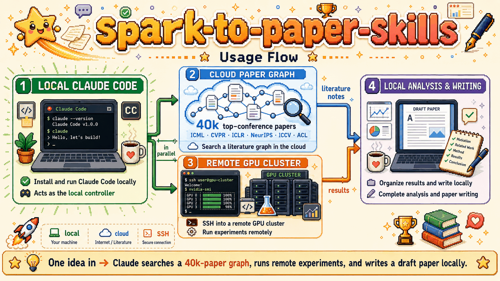
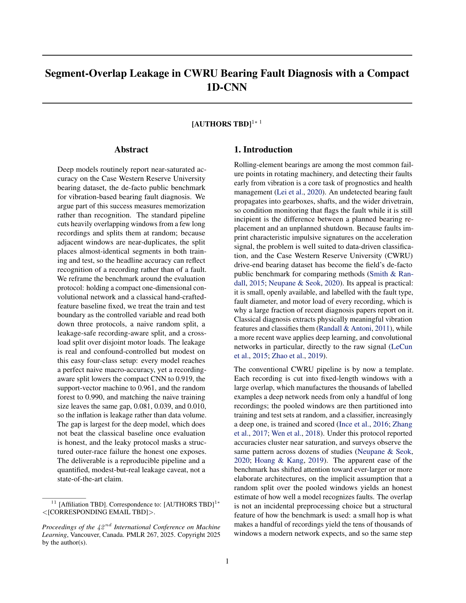
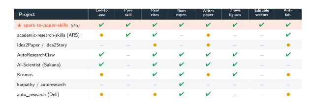
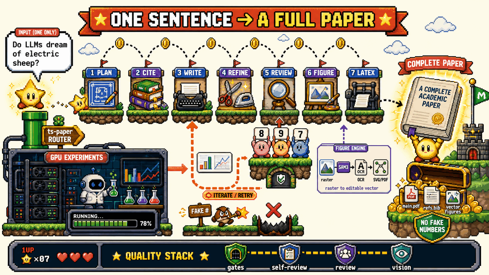

<p align="center">
  
</p>

<h1 align="center">spark-to-paper-skills</h1>

<h3 align="center"><b><i>Drop a spark. Get a paper.</i></b></h3>

<p align="center">
  <i>Citation checks. Editable vector figures. Source-traced numbers.</i>
</p>

<p align="center">
  One orchestrator and 13 composable <a href="https://docs.anthropic.com/en/docs/claude-code/getting-started">Claude Code</a> skills turn a one-line idea into a compiled PDF —<br>
  real references, editable vector figures, and machine-checked integrity included.<br>
  No separate app or orchestration server.
</p>


<p align="center">
  📣 The preprint is on <a href="https://arxiv.org/abs/2608.11924">arXiv:2608.11924</a> —
  <a href="https://huggingface.co/papers/2608.11924"><b>#1 on 🤗 Hugging Face Daily Papers</b></a>
  (Aug 13, 2026) and included in the
  <a href="https://huggingface.co/papers/month/2026-08"><b>August 2026 Monthly Papers</b></a> list.
</p>

<p align="center">
  <a href="https://arxiv.org/abs/2608.11924"></a>
  <a href="https://huggingface.co/papers/2608.11924"></a>
  <a href="https://github.com/Spark-To-Paper-Skills/spark-to-paper-skills/releases/latest"></a>
  <a href="https://github.com/Spark-To-Paper-Skills/spark-to-paper-skills"></a>
  
  
  
  
  <a href="LICENSE"></a>
</p>

<p align="center">
  <a href="https://arxiv.org/abs/2608.11924">📄 Paper</a> &middot;
  <a href="https://spark-to-paper-skills.github.io/spark-to-paper-skills/">🌐 Website</a> &middot;
  <a href="#-generated-paper-showcase">🏆 Showcase</a> &middot;
  <a href="#-what-makes-it-different">✨ Features</a> &middot;
  <a href="#-how-it-compares">🧭 Compare</a> &middot;
  <a href="#-the-figure-engine">🖼️ Figure Engine</a> &middot;
  <a href="#-the-pipeline">🔬 Pipeline</a> &middot;
  <a href="#-quick-start">🚀 Quick Start</a>
</p>

---

## 🏆 Generated Paper Showcase

<table>
<tr>
<td width="18%">
<a href="docs/showcase/SHOWCASE.md"></a>
</td>
<td valign="middle">
<b>7 papers across 6 domains</b> — environmental monitoring, energy forecasting, environmental AI, computer vision, clinical AI, and bearing fault diagnosis — generated fully end-to-end with real citations, editable vector figures, and compiled PDF output. Conference-format samples lead the set: the official ICML 2025 style plus two papers in the official NeurIPS 2025 style.<br><br>
<a href="docs/showcase/SHOWCASE.md"></a>&nbsp;
<a href="docs/showcase/SHOWCASE.md"></a>
</td>
</tr>
</table>

---

## 🔥 What's New

- **`2026-08-13`** — **🤗 Hugging Face Daily Papers #1.** The preprint reached **[#1 on Daily Papers](https://huggingface.co/papers/2608.11924)** and included in the [August 2026 Monthly Papers](https://huggingface.co/papers/month/2026-08) list.
- **`2026-08-12`** — **📄 Preprint submitted.** [*Spark-to-Paper: End-to-End Research Paper Generation as a Composable Skill*](https://arxiv.org/abs/2608.11924) is available as arXiv:2608.11924. See [Citation](#-citation).
- **`v1.2.0`** — **PaperBanana+ figure engine.** The official [PaperBanana](https://github.com/dwzhu-pku/PaperBanana) renders candidates; the new `ts-figure-svg` skill learns the render's design language and redraws the figure natively from the paper's facts, iterating against a stdlib-only geometry audit (`audit_svg.py`) until it passes.
- **`v1.1.0`** — **Claude Code plugin support.** Restructured as a proper plugin with `.claude-plugin/plugin.json`. One-command install, auto-loads on session start.
- **`v1.0.1`** — **Soft update notification.** `check_update.py` queries GitHub Releases API on each run (24h cache, silent when up-to-date, never blocks).
- **`v1.0`** — **Initial release.** 13 skills, end-to-end pipeline, hybrid vector figure engine, MIT License.

---

## ⚡ One Command. One Paper.

```bash
claude plugin marketplace add Spark-To-Paper-Skills/spark-to-paper-skills
claude plugin install spark-to-paper@spark-to-paper-skills
```

Start or reload Claude Code, then run:

```text
/reload-plugins
/spark-to-paper:ts-paper
```

Paste your idea, proposal, or data. The orchestrator auto-routes your input, picks the right mode, and runs the full chain.

---

## 📦 What You Get

<table>
<tr><td>📄</td><td><code>main.tex</code> · <code>main.pdf</code></td><td>Compiled paper in the selected venue template</td></tr>
<tr><td>📝</td><td><code>sections/*.tex</code></td><td>One LaTeX source file per section + abstract</td></tr>
<tr><td>🗺️</td><td><code>blueprint.json</code></td><td>Structured title, keywords, contributions, notation, word targets</td></tr>
<tr><td>📚</td><td><code>refs.bib</code></td><td>Real BibTeX entries — citation records checked via WebSearch and Crossref when available</td></tr>
<tr><td>🖼️</td><td><code>figures/*.pdf</code></td><td>Editable vector figures (SVG + PDF + PPTX), originals always kept</td></tr>
<tr><td>🧪</td><td><code>experiments/</code></td><td>Auto-run experiment code + filled result tables (Stage 8)</td></tr>
<tr><td>📋</td><td><code>logs/*.io.md</code></td><td>Full INPUT / DECISIONS / OUTPUT trace for every stage</td></tr>
<tr><td>🚦</td><td><code>run_gates.py</code></td><td>All deterministic gates pass — citations, draft, vectors, LaTeX</td></tr>
</table>

---

## ✨ What Makes It Different

| | Capability | Description |
|:---:|---|---|
| 🖼️ | **Editable Vector Figures** | A core project focus. The official PaperBanana renders candidates; the figure is then **redrawn natively** — the render's design language learned, its content re-derived from the paper — and iterated against a measuring audit until it passes. Live `<text>`, not a traced bitmap. |
| 🔗 | **End-to-End** | Idea → literature → writing → experiments → figures → compiled PDF, run inside Claude Code as a plugin. |
| 🔒 | **Machine-Checked Integrity** | Deterministic gates check citation records, claim-citation links, source-traced prose numbers, vector structure, and LaTeX; detected violations fail the build. |
| 🔀 | **Two Integrity Modes** | *Proposal mode*: forward-looking, result cells stay blank. *Data-aware mode*: every number traced to your real data, in past tense. Machine-audited. |
| ⚔️ | **Adversarial Review** | N isolated reviewers read the whole paper with verbatim-quote anti-skim, then perspective-diverse skeptics try to refute each issue. Loop until dry. |
| 🧪 | **Auto-Experiments** | Stage 8 diagnoses logic, runs feasible experiments on supplied data/code, fills result tables from run outputs, and recompiles. |
| 📐 | **Template-Agnostic** | NeurIPS and IIETA bundled. Add any venue — drop a `templates/<name>/` dir with `template.json` + LaTeX assets. No code changes. |

---

## 🧭 How It Compares

<p align="center">
  
</p>

<p align="center"><sub><b>✓</b> full&nbsp;&nbsp;·&nbsp;&nbsp;<b>●</b> partial&nbsp;&nbsp;·&nbsp;&nbsp;<b>–</b> none&nbsp;&nbsp;|&nbsp;&nbsp;sources: <a href="https://github.com/Imbad0202/academic-research-skills">ARS</a> · <a href="https://github.com/AgentAlphaAGI/Idea2Paper">Idea2Paper</a> · <a href="https://github.com/aiming-lab/AutoResearchClaw">AutoResearchClaw</a> · <a href="https://github.com/SakanaAI/AI-Scientist">AI-Scientist</a> · <a href="https://github.com/jimmc414/Kosmos">Kosmos</a> · <a href="https://github.com/karpathy/autoresearch">karpathy/autoresearch</a> · <a href="https://victorchen96.github.io/auto_research/framework.html">auto_research</a></sub></p>

> Based on the linked project documentation reviewed in August 2026, the heavier autonomous scientists ([AutoResearchClaw](https://github.com/aiming-lab/AutoResearchClaw), [AI-Scientist](https://github.com/SakanaAI/AI-Scientist)) match the *breadth* but ship as standalone Python products. The lighter *skills* in this comparison ([ARS](https://github.com/Imbad0202/academic-research-skills), [Idea2Paper](https://github.com/AgentAlphaAGI/Idea2Paper)) do not cover the same experiment-and-figure path. This comparison is scoped to the listed projects, not the entire ecosystem.

---

## 🖼️ The Figure Engine

**A core differentiator of this project.** AI image models produce rasters — but a paper needs editable vector figures whose labels are *text* and whose logic is *the paper's*.

`ts-figure-svg` is **PaperBanana+**: the [official PaperBanana](https://github.com/dwzhu-pku/PaperBanana) renders candidates, then the figure is **redrawn natively** — its design language learned from the render, its content re-derived from the paper, repaired against a measuring audit.

```
figure brief (from the paper's own method text)
   ├─ PaperBanana      → Retriever→Planner→Stylist→Visualizer→Critic   (official, pulled)
   ├─ pick a candidate → scientific correctness first, beauty last
   ├─ learn the STYLE  → palette · type scale · spacing · idiom  →  <label>.style.json
   ├─ redraw NATIVE    → real <rect>/<path>/<text>, content from the PAPER, never a pixel trace
   └─ audit & repair   → iterate until the audit passes and the result is approved
   │
   └─▶ editable SVG · vector PDF   (live text, verified at real column width)
```

`audit_svg.py` measures what eyes miss — and it is **stdlib-only** (Adobe core-14 Times metrics, no renderer, no key, no models):

| Catches | Because |
|---|---|
| Canvas/card overflow, text-on-text, "just barely inside" | *Not* overflowing is not a pass |
| A shape painted over a label | z-order cuts labels in half |
| `markerUnits="strokeWidth"` | a 6-unit arrowhead renders at ~18px |
| Connectors docking on nothing, floating labels | endpoints typed by hand, no alignment grid |
| Sub-legible type, `✓`-class glyphs | shrinking text is the forbidden fix; odd glyphs silently swap font family in the PDF |
| Embedded rasters, data URIs, traced pixel paths | a bitmap in an XML costume is still blurry at 2× |

**Fallbacks, in order:** native redraw → local raster-preserving optimization → keep the approved PNG. Never a lossy redraw, never a flat boxes-and-arrows regression.

<details>
<summary>Provision</summary>

```bash
python skills/ts-figure-svg/scripts/setup_paperbanana.py            # pull official PaperBanana + deps
export OPENROUTER_API_KEY="sk-or-v1-..."                            # VLM agents + image generation
python skills/ts-figure-svg/scripts/audit_svg.py --selftest         # the audit needs nothing else

```
</details>

---

<p align="center"><b><i>One spark in. One paper out.</i></b></p>

<p align="center">
  
</p>

---

## 🔬 The Pipeline

One orchestrator (`ts-paper`) routes the input, then drives a **7-stage chain** plus auto-run experiments:

```
                         ┌──────────────── optional upstream ────────────────┐
 [corpus.jsonl] ─▶ ts-kg-build ─▶ kg/         (research-pattern KG)
 [raw idea]     ─▶ ts-idea2story ─▶ story + citation seed
                         └──────────────────────────────────────────────────┘
                                                │
 [proposal  OR  proposal + real results]  ─────▶ ts-paper  (Stage 0: ROUTE)
                                                │
   1. ts-paper-plan ──▶ blueprint.json          title · keywords · contributions
   2. ts-paper-cite ──▶ refs.bib                ≥40 REAL refs via WebSearch + Crossref
   3. ts-paper-write ─▶ sections/*.tex          all sections in one holistic pass
   4. ts-paper-refine ▶ right-size + de-AI      scrub + logic self-check
   5. ts-paper-review ▶ adversarial review      multi-reviewer hardening
   6. ts-paper-figure ▶ figures + native SVG    PaperBanana → learn style → redraw + audit
   7. ts-paper-latex ─▶ main.pdf                assemble + compile
                                                │
   8. ts-paper-experiment (AUTO) ─▶ run feasible experiments, fill tables, recompile
```

<details>
<summary><b>Stage 0 — Input routing</b></summary>
<br>

| Class | What was dropped | Route | `results_mode` |
|---|---|---|---|
| **(a) bare idea** | one line, no method/eval structure | `ts-idea2story` → plan | `proposal` |
| **(b) proposal** | problem + method + eval, no measured results | plan (proposal) | `proposal` |
| **(c) proposal + REAL results** | measured numbers or attached data file | plan → `ts-paper-data` | `data_aware` |
| **(d) existing `story.json`** | 8-field story from a prior run | plan (skip idea2story) | `proposal` |

</details>

### Two modes, opposite integrity rules

| | **Proposal mode** | **Data-aware mode** |
|---|---|---|
| Numbers | Never invent — cells stay blank (`--`) | Report real numbers, past tense |
| Guarantee | No metric ever fabricated | Every number traces to your data (machine-audited) |

---

## 🎯 Design Philosophy

|     | Principle | Rule |
| :-: | :--- | :--- |
| 🧠 | **Model reasons** | Claude owns judgment-heavy work: writing, research, critique, review |
| 🛠 | **Code backstops** | Python handles deterministic tasks: linting, assembly, plotting, vectorization |
| 🪶 | **Zero infra** | No app, server, database, or Docker — install the Claude Code plugin and go |
| 🏆 | **Quality first** | Verify citations, self-review, run linters, polish before delivery |
| 🔒 | **Integrity always** | Never invent numbers; trace every value to source data; red gates fail the build |

---

## 🛡️ Quality Stack

Four complementary layers — Claude handles judgment, code provides the deterministic backstop.

| # | Layer | What it checks |
|---:|---|---|
| **1** | **Deterministic gates** | Section shape · word bands · no-fabrication · citation completeness · vector-PDF presence |
| **2** | **Self-review** | Right-sizing · term consistency · coherence · de-AI scrub |
| **3** | **Adversarial review** | N isolated reviewers · verbatim-quote anti-skim · loop until dry |
| **4** | **Vision critique** | Reads each rendered figure · checks faithfulness · readability · aesthetics |

```bash
python skills/ts-paper/scripts/run_gates.py <workdir> all     # nonzero exit = NOT done
```

---

## 📐 Template-Agnostic

Write to **whatever venue you pick** — content quality is invariant.

| Template | Venue | Style |
|---|---|---|
| `ts_iieta` *(default)* | Traitement du Signal | Two-column, numeric citations |
| `neurips` | NeurIPS (community) | Single-column, author-year |
| `neurips_official` | NeurIPS 2025 (official .sty) | Single-column, official formatting |

**Add a venue** by dropping a `templates/<name>/` dir with `template.json` + LaTeX assets — no code changes.

---

## 🧩 The Skills

1 orchestrator plus 13 composable skills; all active.

| Skill | Stage | Role |
|---|---|---|
| **`ts-paper`** | orchestrator | Routes input (idea / proposal / data) and drives the chain |
| `ts-idea2story` | upstream | Raw idea → structured research story + citation seed |
| `ts-kg-build` | upstream (opt.) | Corpus → research-pattern knowledge graph for recall |
| `ts-paper-plan` | 1 | Proposal → `blueprint.json` (one reasoning pass) |
| `ts-paper-cite` | 2 | Real, complete bibliography (WebSearch + Crossref, floor 40) |
| `ts-paper-write` | 3 | Draft all sections as LaTeX in one holistic pass |
| `ts-paper-refine` | 4 | Right-size + de-AI scrub + logic self-check |
| `ts-paper-review` | 5 | Adversarial peer-review hardening |
| `ts-paper-figure` | 6 | Figure routing: matplotlib (data) / PaperBanana (schematics) |
| `ts-paper-data` | 6 (data) | Data-aware mode: real results → filled tables + plots |
| `ts-figure-svg` | 6 (vector) | PaperBanana+ : learn the render's style → native audited SVG |
| `ts-figure-optimize` | 6 (fallback) | Raster → editable SVG/PDF/PPTX via local hybrid optimization |
| `ts-paper-latex` | 7 | Assemble + compile the final PDF |
| `ts-paper-experiment` | 8 | Run feasible experiments, fill tables, recompile |

---

## 🚀 Quick Start

### 1 · Install

**Option A — User scope (recommended)**

```bash
claude plugin marketplace add Spark-To-Paper-Skills/spark-to-paper-skills
claude plugin install spark-to-paper@spark-to-paper-skills
```

Available in all projects for the current user. Run `/reload-plugins` in an existing Claude Code session, then use `/spark-to-paper:ts-paper`.

**Option B — Current repository, personal only**

```bash
cd /path/to/your/project
claude plugin marketplace add Spark-To-Paper-Skills/spark-to-paper-skills --scope local
claude plugin install spark-to-paper@spark-to-paper-skills --scope local
```

This writes project-local, gitignored configuration to `.claude/settings.local.json`.

**Option C — Current repository, shared with collaborators**

```bash
cd /path/to/your/project
claude plugin marketplace add Spark-To-Paper-Skills/spark-to-paper-skills --scope project
claude plugin install spark-to-paper@spark-to-paper-skills --scope project
```

Commit the resulting `.claude/settings.json` so collaborators are prompted to use the same marketplace and plugin.

**Option D — Try or develop without installing**

```bash
git clone https://github.com/Spark-To-Paper-Skills/spark-to-paper-skills.git
claude --plugin-dir ./spark-to-paper-skills
```

Do not clone the whole repository into `.claude/skills/spark-to-paper-skills`. That directory expects standalone skill folders shaped like `.claude/skills/<skill-name>/SKILL.md`; this repository is a plugin whose skills live under `skills/`.

> 💡 Update an installed plugin with `claude plugin update spark-to-paper@spark-to-paper-skills`. Add `--scope project` or `--scope local` when updating a non-user installation.

### 2 · (Optional) Configure secrets

| Secret | Variables | When needed |
|---|---|---|
| 🎨 **Figure model** | `TS_FIG_API_KEY`, `TS_FIG_BASE_URL`, `TS_FIG_MODEL` | Render schematics with an image model |
| 👁️ **Vision QA** | `OPENAI_API_KEY`, `VISION_MODEL` | Correct figure text, per-region defect comparison |
| 🧠 **Embeddings** | `TS_EMBED_*` | KG-grounded recall (optional, graceful degradation) |
| 📦 **Raster fallback** | `HF_TOKEN` | Download optional local vision weights once |
| ☁️ **Overleaf** | `OVERLEAF_GIT_URL`, `OVERLEAF_TOKEN` | Sync with Overleaf when enabled |

Copy `.env.example` → `.env` and fill in only what you use.

### 3 · Just ask Claude

```text
/spark-to-paper:ts-paper
```

Paste your idea, proposal, or proposal + data. The orchestrator auto-routes, runs the chain, and delivers a compiled paper with page count, sections, references, review outcome, and editable vector figures.

---

## ⚙️ Requirements

- **Claude Code** (the suite is a plugin)
- **Python 3.10+** with `pip install -r skills/ts-figure-optimize/requirements.txt`
- **LaTeX** (`latexmk` + a TeX distribution) for compilation
- *Optional:* local raster fallback runtime (~4 GB) · image-model endpoint · LibreOffice

---

## 🙋 FAQ

<details>
<summary><b>Will it invent results to make the paper look complete?</b></summary>
<br>
The workflow is designed not to fill results without evidence. In proposal mode, <code>draft_lint</code> fails the build on prose numbers that are not backed by data. In data-aware mode, prose-number checks use <code>results.facts.json</code>; result tables remain subject to the current gate coverage documented in the code.
</details>

<details>
<summary><b>How is this different from AutoResearchClaw / AI-Scientist / Kosmos?</b></summary>
<br>
The heavier autonomous scientists in the comparison match the breadth but ship as standalone Python products. Spark-to-Paper runs the full arc as a Claude Code plugin and includes an editable-vector figure engine. The comparison is limited to the linked projects reviewed in August 2026.
</details>

<details>
<summary><b>Do I need GPUs or the optional raster runtime?</b></summary>
<br>
Only for the local free-form raster fallback. It can run on CPU; matplotlib figures are born-vector and skip it, and a paper with no figures skips Stage 6 entirely.
</details>

<details>
<summary><b>Can I use a venue that isn't bundled?</b></summary>
<br>
Yes — drop a <code>templates/&lt;name&gt;/</code> directory with <code>template.json</code> + LaTeX assets. No code changes.
</details>

---

## ✅ Definition of Done

`main.pdf` exists and is non-trivial · **zero LaTeX errors** · `main.bbl` resolved all citations · every `\cite{}` maps to a complete `refs.bib` entry · **no fabricated numbers** anywhere · **every figure embedded as an editable vector PDF** · the adversarial **review stage ran** · and `run_gates.py <workdir> all` **exits zero**.

---

## 📖 Citation

A paper produced end-to-end by Spark-to-Paper has been accepted by an **SCI-indexed Q2 journal**. Until the version of record is public, please cite the arXiv version below. The preprint reached **#1 on [🤗 Hugging Face Daily Papers](https://huggingface.co/papers/2608.11924)** (Aug 13, 2026) and is included in the [August 2026 Monthly Papers](https://huggingface.co/papers/month/2026-08) list.

If Spark-to-Paper helps your research, please cite:

```bibtex
@article{qian2026sparktopaper,
  author  = {Qian, Zhuoyang and Wu, Biao and Wang, Yiran and Yan, Chris D and
             Dai, Desan and Zheng, Liangwei and Jiang, Jin and
             Zhang, Junsheng and Wang, Wenhao},
  title   = {Spark-to-Paper: End-to-End Research Paper Generation
             as a Composable Skill},
  journal = {arXiv preprint arXiv:2608.11924},
  year    = {2026},
  url     = {https://arxiv.org/abs/2608.11924}
}
```

---

## 🙏 Acknowledgments

Inspired by:

- 🔬 [AI-Scientist](https://github.com/SakanaAI/AI-Scientist) (Sakana AI) — Automated research pioneer
- 🦞 [AutoResearchClaw](https://github.com/aiming-lab/AutoResearchClaw) (AIMING Lab) — 23-stage autonomous research pipeline
- 📚 [academic-research-skills](https://github.com/imbad0202/academic-research-skills) (Imbad0202) — Claude Code research skill suite
- 🧠 [autoresearch](https://github.com/karpathy/autoresearch) (Andrej Karpathy) — End-to-end research automation

---

## ⭐ Star History

<p align="center">
  <a href="https://star-history.com/#Spark-To-Paper-Skills/spark-to-paper-skills&Date">
    
  </a>
</p>

<p align="center"><sub>Live star chart paused — GitHub restricted third-party access to stargazer data. It returns once the <a href="https://star-history.com/blog/github-stargazer-api-restriction">star-history GitHub App</a> is installed on this repo.</sub></p>

---

<p align="center">
  <i>The model does the reasoning. The code keeps it honest. You get a paper.</i><br>
  <sub>Built on <a href="https://docs.anthropic.com/en/docs/claude-code/getting-started">Claude Code</a> · native editable SVG figure engine · <a href="LICENSE">MIT License</a></sub>
</p>
