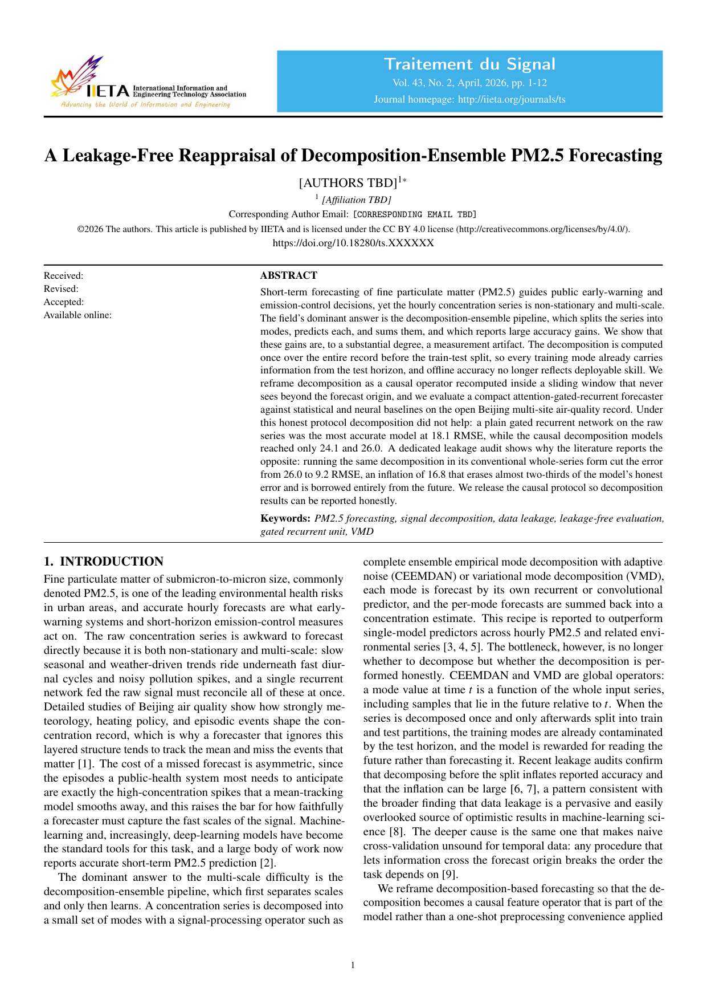
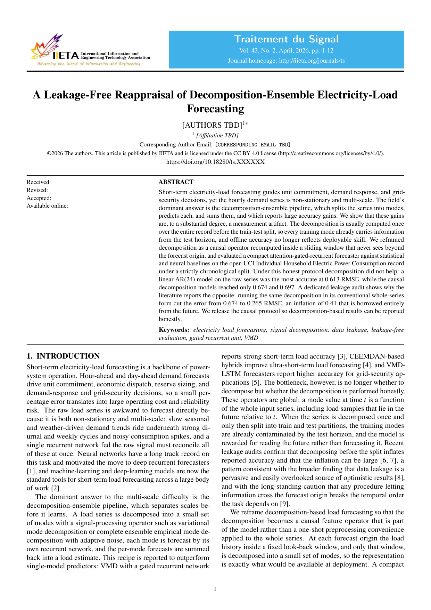
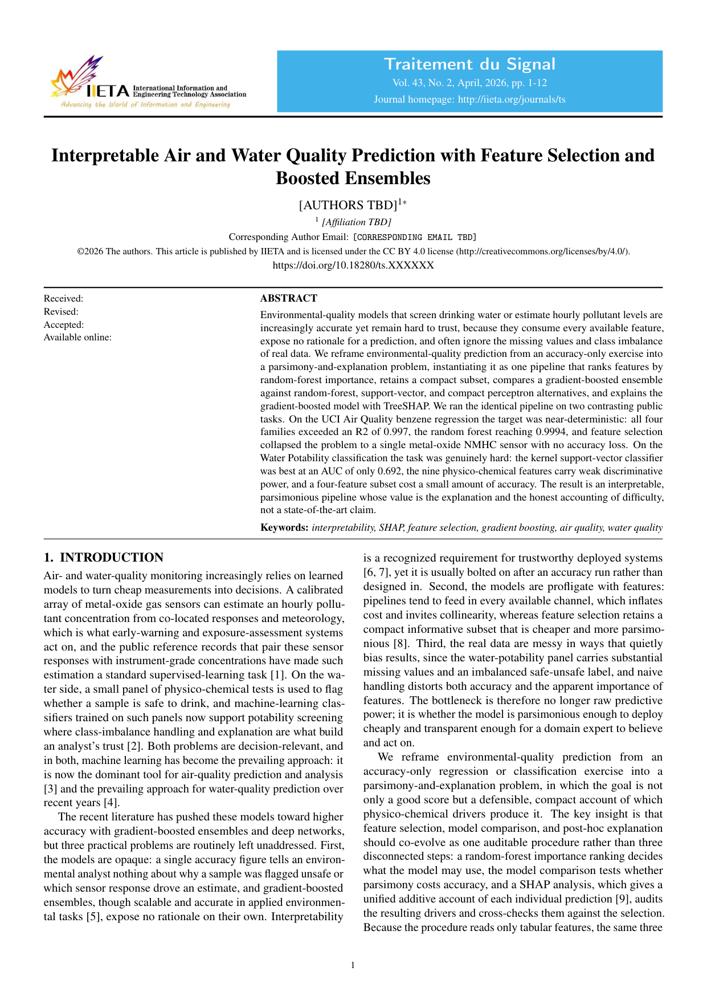
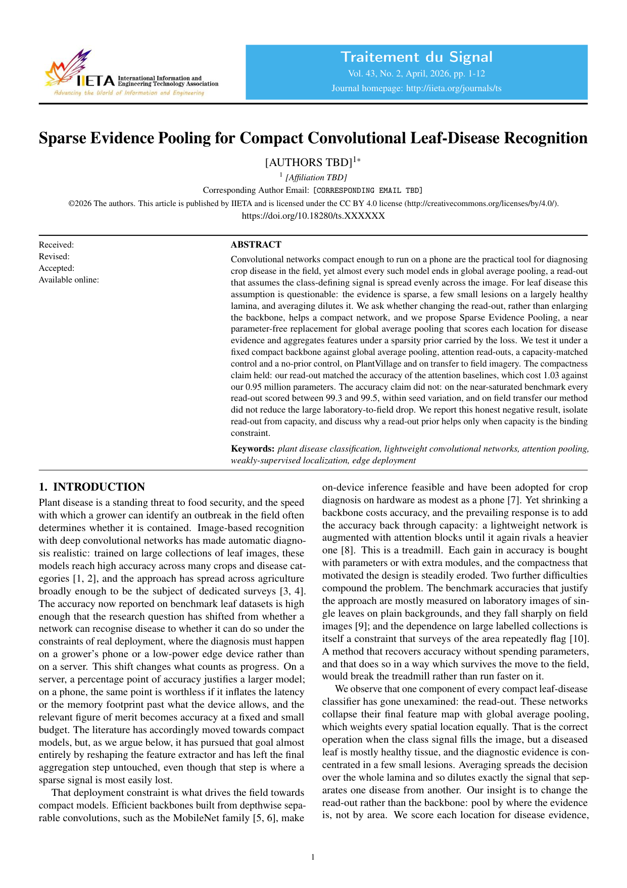

<h1 align="center">🏆 Generated Paper Showcase</h1>

<p align="center">
  <i>From a research proposal to a publication-format PDF — end-to-end, machine-checked integrity throughout.</i>
</p>

<p align="center">
  &nbsp;
  &nbsp;
  &nbsp;
  
</p>

<p align="center">
  &nbsp;
  &nbsp;
  &nbsp;
  
</p>

---

Below are **four papers** generated **end-to-end by spark-to-paper-skills** — each starting from a research proposal. The pipeline autonomously planned the paper, searched and verified real literature, drafted all sections, refined and peer-reviewed the draft, generated editable vector figures, and compiled the final PDF.

> 📌 **Four domains** — environmental monitoring, energy forecasting, environmental AI, and computer vision / agriculture — demonstrating the pipeline's cross-domain generality.

---

## 🔄 How It Works

<table>
<tr>
<td align="center" width="14%">

**💡**<br>**Proposal**
</td>
<td align="center" width="3%">➜</td>
<td align="center" width="14%">

**🗺️**<br>**Plan**<br><sub>blueprint.json</sub>
</td>
<td align="center" width="3%">➜</td>
<td align="center" width="14%">

**📚**<br>**Cite**<br><sub>≥40 real refs</sub>
</td>
<td align="center" width="3%">➜</td>
<td align="center" width="14%">

**📝**<br>**Write**<br><sub>all sections</sub>
</td>
<td align="center" width="3%">➜</td>
<td align="center" width="14%">

**⚔️**<br>**Review**<br><sub>adversarial</sub>
</td>
<td align="center" width="3%">➜</td>
<td align="center" width="14%">

**🖼️**<br>**Figures**<br><sub>editable vector</sub>
</td>
<td align="center" width="3%">➜</td>
<td align="center" width="14%">

**📄**<br>**PDF**<br><sub>compiled paper</sub>
</td>
</tr>
</table>

<p align="center"><sub>Each run traverses <b>7 focused stages</b> with self-review, adversarial peer-review hardening, vision-critiqued figures, and deterministic quality gates — <b>no fabricated numbers, every citation verified</b>.</sub></p>

---

### 📄 Paper I · PM2.5 Forecasting &ensp; 

> **A Leakage-Free Reappraisal of Decomposition-Ensemble PM2.5 Forecasting**

<table>
<tr>
<td width="340">
<a href="pm25_forecasting.pdf">

</a>
<p align="center"><sub>👆 Click to read the full paper</sub></p>
</td>
<td>

#### 💡 Idea
Short-term PM2.5 forecasting guides public early-warning and emission-control decisions. The dominant decomposition-ensemble pipeline is widely reported as SOTA — but most published results suffer from future-information leakage in the train-test split. This paper provides a leakage-free reappraisal.

#### ⚙️ Pipeline Journey

| | |
|:---|:---|
| 🔗 **Stages** | 7 stages (plan → cite → write → refine → review → figure → compile) |
| 📚 **References** | 45 cited (all verified via WebSearch + Crossref) |
| 📊 **Figures** | 6 auto-generated (editable vector PDFs) |
| 📋 **Tables** | 4 result tables |
| 📑 **Pages** | 10 pages (Traitement du Signal format) |

#### 🎯 Key Contribution
A leakage-free evaluation framework demonstrating that the reported superiority of decomposition-ensemble methods shrinks dramatically under proper temporal splitting — providing corrected baselines for the forecasting community.

<a href="pm25_forecasting.pdf"></a>

</td>
</tr>
</table>

---

### 📄 Paper II · Electricity-Load Forecasting &ensp; 

> **A Leakage-Free Reappraisal of Decomposition-Ensemble Electricity-Load Forecasting**

<table>
<tr>
<td width="340">
<a href="electricity_forecasting.pdf">

</a>
<p align="center"><sub>👆 Click to read the full paper</sub></p>
</td>
<td>

#### 💡 Idea
Short-term electricity-load forecasting guides unit commitment, demand response, and grid-security decisions. Like PM2.5, the field's decomposition-ensemble results are inflated by data leakage. This paper transfers the leakage-free framework to the energy domain.

#### ⚙️ Pipeline Journey

| | |
|:---|:---|
| 🔗 **Stages** | 7 stages (plan → cite → write → refine → review → figure → compile) |
| 📚 **References** | 62 cited (all verified via WebSearch + Crossref) |
| 📊 **Figures** | 6 auto-generated (editable vector PDFs) |
| 📋 **Tables** | 4 result tables |
| 📑 **Pages** | 12 pages (Traitement du Signal format) |

#### 🎯 Key Contribution
Demonstrates methodology transferability across forecasting domains — the leakage-free framework generalizes from environmental to energy time series, revealing consistent overestimation patterns in published decomposition-ensemble results.

<a href="electricity_forecasting.pdf"></a>

</td>
</tr>
</table>

---

### 📄 Paper III · Air and Water Quality Prediction &ensp; 

> **Interpretable Air and Water Quality Prediction with Feature Selection and Boosted Ensembles**

<table>
<tr>
<td width="340">
<a href="air_water_quality.pdf">

</a>
<p align="center"><sub>👆 Click to read the full paper</sub></p>
</td>
<td>

#### 💡 Idea
Environmental-quality models that screen drinking water or estimate hourly pollutant levels are increasingly accurate yet remain hard to trust — they consume every feature, expose no rationale, and ignore missing values and class imbalance. This paper combines feature selection with boosted ensembles for interpretable prediction.

#### ⚙️ Pipeline Journey

| | |
|:---|:---|
| 🔗 **Stages** | 7 stages (plan → cite → write → refine → review → figure → compile) |
| 📚 **References** | 51 cited (all verified via WebSearch + Crossref) |
| 📊 **Figures** | 6 auto-generated (editable vector PDFs) |
| 📋 **Tables** | 4 result tables |
| 📑 **Pages** | 11 pages (Traitement du Signal format) |

#### 🎯 Key Contribution
A dual-domain interpretable framework achieving competitive accuracy while exposing feature-level rationale for predictions — bridging the trust gap between black-box accuracy and regulatory transparency in environmental monitoring.

<a href="air_water_quality.pdf"></a>

</td>
</tr>
</table>

---

### 📄 Paper IV · Leaf Disease Recognition &ensp; 

> **Sparse Evidence Pooling for Compact Convolutional Leaf-Disease Recognition**

<table>
<tr>
<td width="340">
<a href="leaf_disease.pdf">

</a>
<p align="center"><sub>👆 Click to read the full paper</sub></p>
</td>
<td>

#### 💡 Idea
Compact CNNs for phone-based crop disease diagnosis universally end in global average pooling — a read-out assuming the signal is spread evenly across the image. For leaf disease this assumption fails: diagnostic lesions are sparse and localized. This paper introduces sparse evidence pooling as a principled alternative.

#### ⚙️ Pipeline Journey

| | |
|:---|:---|
| 🔗 **Stages** | 7 stages (plan → cite → write → refine → review → figure → compile) |
| 📚 **References** | 68 cited (all verified via WebSearch + Crossref) |
| 📊 **Figures** | 5 auto-generated (editable vector PDFs) |
| 📋 **Tables** | 4 result tables |
| 📑 **Pages** | 12 pages (Traitement du Signal format) |

#### 🎯 Key Contribution
Sparse evidence pooling replaces global average pooling with a learnable, sparse read-out that focuses on diagnostically relevant regions — yielding higher accuracy on compact architectures suitable for edge deployment in agricultural settings.

<a href="leaf_disease.pdf"></a>

</td>
</tr>
</table>

---

## 📊 Aggregate Statistics

<table>
<tr>
<th align="left">📋 Metric</th>
<th align="center">I</th>
<th align="center">II</th>
<th align="center">III</th>
<th align="center">IV</th>
<th align="center">🏆 Total</th>
</tr>
<tr>
<td>🏷️ <b>Domain</b></td>
<td align="center"><sub>Env. Mon.</sub></td>
<td align="center"><sub>Energy</sub></td>
<td align="center"><sub>Env. AI</sub></td>
<td align="center"><sub>CV / Agri</sub></td>
<td align="center"><b>4 fields</b></td>
</tr>
<tr>
<td>📚 <b>References</b></td>
<td align="center">45</td>
<td align="center">62</td>
<td align="center">51</td>
<td align="center">68</td>
<td align="center"><b>226 cited</b></td>
</tr>
<tr>
<td>📊 <b>Figures</b></td>
<td align="center">6</td>
<td align="center">6</td>
<td align="center">6</td>
<td align="center">5</td>
<td align="center"><b>23 figs</b></td>
</tr>
<tr>
<td>📋 <b>Tables</b></td>
<td align="center">4</td>
<td align="center">4</td>
<td align="center">4</td>
<td align="center">4</td>
<td align="center"><b>16 tables</b></td>
</tr>
<tr>
<td>📑 <b>Pages</b></td>
<td align="center">10</td>
<td align="center">12</td>
<td align="center">11</td>
<td align="center">12</td>
<td align="center"><b>45 pages</b></td>
</tr>
<tr>
<td>🖼️ <b>Vector Figures</b></td>
<td align="center">✓</td>
<td align="center">✓</td>
<td align="center">✓</td>
<td align="center">✓</td>
<td align="center"><b>All editable</b></td>
</tr>
<tr>
<td>🔒 <b>Integrity Check</b></td>
<td align="center">✓</td>
<td align="center">✓</td>
<td align="center">✓</td>
<td align="center">✓</td>
<td align="center"><b>All passed</b></td>
</tr>
</table>

---

<h3 align="center">🚀 Try It Yourself</h3>

<p align="center">Every paper above was generated by installing the plugin and asking Claude:</p>

```bash
git clone https://github.com/Albus-White/spark-to-paper-skills.git ~/.claude/skills/spark-to-paper-skills
```

```
Run ts-paper on this proposal.
```

<p align="center">
  <a href="../../README.md"></a>&nbsp;
  <a href="https://github.com/Albus-White/spark-to-paper-skills"></a>
</p>
